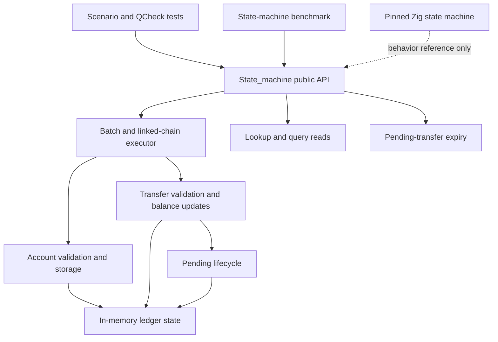

# OCaml ledger core: zoomed-out map

## Scope and boundary

This repository experiments with an OCaml implementation of part of
TigerBeetle’s ledger state machine. The implementation is a deterministic,
in-memory core, not a TigerBeetle server. The pinned upstream source at
`path/to/tigerbeetle/` is the behavior oracle.

The public library is `tigerbeetle_ocaml.state_machine`, implemented in
`ocam/src/state_machine.ml` and described by `ocam/src/state_machine.mli`.
The core has no storage, network, clock, Async, C-ABI, or wire-codec
dependency. A future adapter must receive replication commits, provide their
timestamps, invoke the core in commit order, and persist the result.

## Module and caller map

| Area | Relevant module or file | Role |
| --- | --- | --- |
| Public model and API | `ocam/src/state_machine.mli` | Defines `U128`, account and transfer records, flags, statuses, filters, state, and public operations. |
| Deterministic core | `ocam/src/state_machine.ml` | Implements all accounting behavior and maintains the in-memory state. |
| Scenario callers | `ocam/test/state_machine_test.ml` | Covers single-phase transfers, pending post/void, linked rollback, and validation precedence. |
| Property callers | `ocam/test/state_machine_property_test.ml` | Checks determinism, balance conservation, idempotency, linked atomicity, pending lifecycle, query ordering, and `U128` boundaries. |
| Benchmark caller | `ocam/bench/state_machine_bench.ml` | Applies 30,000 prebuilt posted transfers in batches of 30 and reports throughput, latency, and allocation. |
| Dune wiring | `ocam/src/dune`, `ocam/test/dune`, `ocam/bench/dune` | Builds the library, tests, and benchmark. |
| Behavior oracle | `path/to/tigerbeetle/src/state_machine.zig` | The upstream state machine coupled to TigerBeetle’s LSM, VSR, and wire-level components. It is not called by the OCaml core. |

There are no production/server callers of the OCaml API yet. Dune currently
builds only the OCaml library and its test/benchmark consumers.

## Domain model

`State_machine.t` owns the ledger's mutable state:

- accounts, keyed by `U128` account ID;
- transfers, keyed by `U128` transfer ID;
- pending-transfer status: `Pending`, `Posted`, `Voided`, or `Expired`;
- per-transfer balance history for history-enabled accounts;
- transfer IDs consumed by transient failures; and
- the most recent successful `commit_timestamp`.

`U128` is an explicit unsigned 128-bit value used for account/transfer IDs and
amounts. Addition and subtraction report overflow or underflow; they never
silently wrap.

An account has four monotonic balances:

| Debit side | Credit side |
| --- | --- |
| `debits_pending` | `credits_pending` |
| `debits_posted` | `credits_posted` |

Successful normal transfers update posted balances. Successful pending
transfers update pending balances. Across successful transfers, total debits
and credits remain equal for both balance classes.

## Write path

`create_accounts` and `create_transfers` are the public batch boundaries.

1. `chains` groups adjacent requests marked `linked`.
2. A single unlinked request runs directly. A linked chain runs against a
   cloned ledger state.
3. On success, `replace_state` commits the clone. On any failure, the failed
   request retains its status and every other event in the chain becomes
   `*_linked_event_failed`.
4. A final `linked` request leaves an open chain; complete prefix chains still
   commit, while only the open suffix is rejected.

### Account creation

`create_account_one` validates non-zero IDs, ledger, and code; requires zero
initial balances; applies the mutually exclusive balance-constraint flags;
and handles exact idempotent retries. For ordinary accounts, the request
timestamp must be zero and the supplied commit timestamp is assigned. Imported
accounts carry their own timestamp, subject to ordering constraints.

### Transfer creation and resolution

`create_transfer_one` handles ordinary and pending transfers. It validates
transfer identity, account identity and existence, ledger agreement, account
closure, amount/balance constraints, timestamps, and arithmetic before it
updates state.

`post_or_void` resolves an existing pending transfer. Posting removes the
original pending amount and adds the resolved amount to posted balances.
Voiding removes pending balances without adding posted balances. A pending
transfer may also be `Expired` by `expire_pending_transfers`, which removes
the pending balances and prevents later post or void requests.

## Read path

| Operation | Meaning |
| --- | --- |
| `lookup_accounts`, `lookup_transfers` | Return found records in requested ID order; omit unknown IDs. |
| `query_accounts`, `query_transfers` | Filter metadata, ledger, code, and timestamp; sort by timestamp; reverse if requested; apply the limit. |
| `get_account_transfers` | Return debit-side and/or credit-side transfers for one account. |
| `get_account_balances` | Return filtered per-transfer balance snapshots for a history-enabled account. |

## Compatibility boundary

The upstream Zig state machine uses explicit wire/storage structures and is
integrated with the LSM forest and VSR replication. The OCaml core is not yet
linked into that path. Remaining integration work includes a C ABI,
wire-compatible 128-byte codecs, a complete differential corpus, exact result
code encoding, CDC objects, and further imported/query/expiry edge
cases. See `ocam/OCAML_REWRITE.md` for the maintained compatibility scope.
